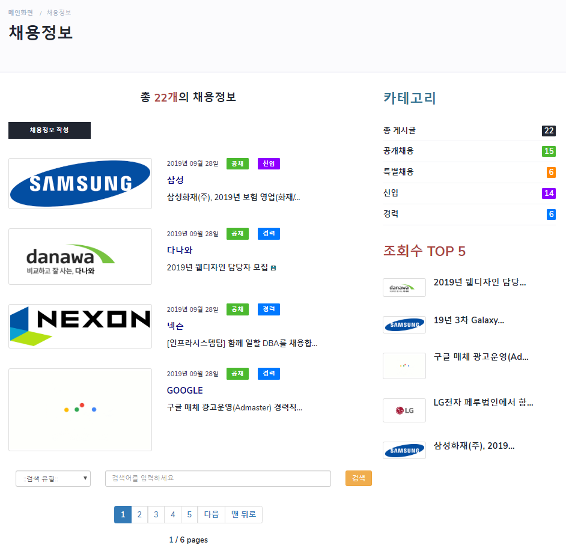
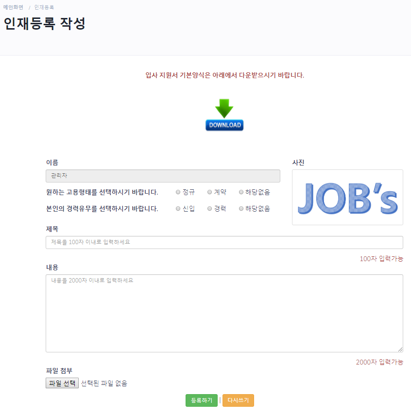
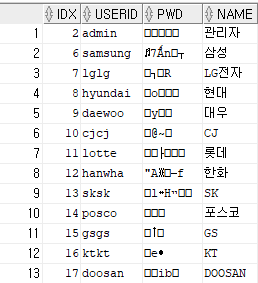
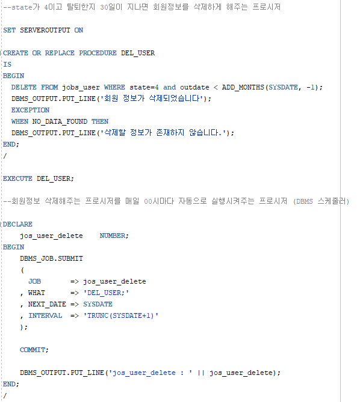
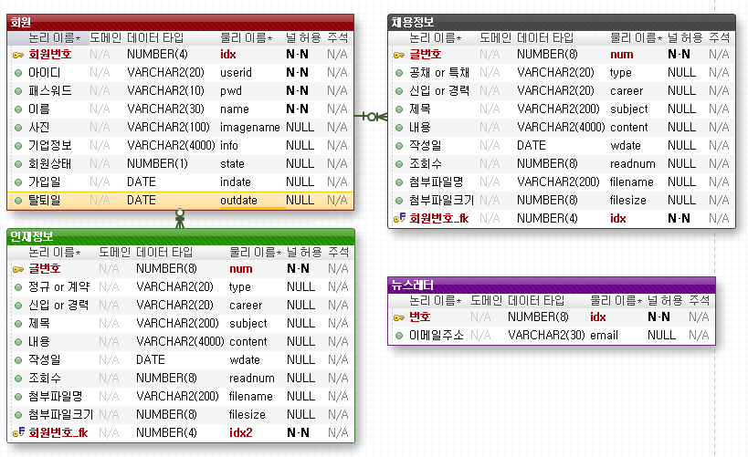

# Jobs

## 1. 목차
```
.Jobs 구인, 구직 사이트
├── 1.목차
├── 2.URL
├── 3.개요
├── 4.특징
├── 5.사용법
|   ├── 5.1.개발 환경 & 개발 툴
|   └── 5.2.실행 방법
|       ├── 5.2.1 실행 환경 세팅
|       └── 5.2.2 실행
└── 6.스크린샷
    ├── 6.1.메인 화면
    ├── 6.2.채용정보 화면
    ├── 6.3.기업정보 화면
    ├── 6.4.인재정보 화면
    ├── 6.5.인재등록 화면
    ├── 6.6.암호화 처리된 패스워드 화면
    ├── 6.7.탈퇴회원 관리 프로시저 화면
    └── 6.8.데이터베이스 테이블 화면
```

## 2. URL 
# http://0254.duckdns.org:9090/jobs


## 3. 개요
 - **Spring Framework**로 구현한 **MVC패턴의 포털 사이트**입니다. 
 - 사이트에는 회원가입과 로그인, 네이버 ID로 로그인, 채용정보, 기업정보, 인재정보, 뉴스레터 등록 등의 기능이 구현되어 있습니다.
 - Maven, MyBatis, Log4j, Lombok, 네이버 API, 구글 API 등 다양한 라이브러리 및 유틸리티를 활용하였습니다. 
 
 
 
## 4. 특징
- 로그인을 해야 모든 서비스를 이용 가능하게 하였으며, 회원상태는 일반회원, 기업회원, 관리자, 정지회원, 탈퇴회원으로 나누었습니다.
- 자체 회원가입과 로그인 기능이 구현되어있지만 네이버 로그인 API를 이용하여 네이버 아이디로로 로그인이 가능하도록 하였습니다.
- 채용정보, 기업정보, 인재정보 게시판을 구현하였고 각 카테고리와 게시글 검색이 가능하도록 구현하였습니다.
- Contact부분에는 구글 맵 API를 이용하여 지도를 띄웠습니다.
- 관리자 페이지를 따로 구현하여 게시글과 회원관리를 쉽게 할 수 있도록 했습니다.
- 패스워드는 DES알고리즘 암호화를 이용하여 쉽게 노출되지 않도록 보안성을 높였습니다.
- 회원탈퇴시 탈퇴일이 등록있고 1달이 지난 회원정보를 매일 00시에 확인하여 자동으로 삭제해주는 DBMS스케줄러 기능을 구현했습니다.
- 반응형 웹페이지로 PC와 MOBILE등 각 기기에 맞도록 최적화된 화면을 보여줍니다.
- aws로 구동하며 도메인을 이용하여 어디에서나 http://0254.duckdns.org:9090/jobs 를 입력하면 접속이 가능하도록 하였습니다.


## 5. 사용법
### 5.1. 개발 환경 & 개발 툴
- Programing Language : HTML, CSS, JavaScript, jQuery, Java 8, JSP, Servlet
- Framework : Bootstrap, Spring 5.0.7, MyBatis
- Database : Oracle Database 11g Express
- API : NAVER Login API, Google Maps JavaScript API
- Server : Apache Tomcat 8.5
- OS: Windows 10 
-----------------------------------------------------------------------------
- Tool : Spring Tool Suite, VS code
- DB Modeling Tool : Exerd
- Graphic Tool : Adobe Photoshop CC


### 5.2. 실행 방법
#### 5.2.1 실행환경 세팅
```
# 1. Spring Tool Suite에 해당 프로젝트를 import 합니다.
- ojdbc6.jar 파일이 lib 폴더에 포함되어 있습니다. 
# 2. src/main/resources/DDL 폴더에 있는 JOBs.sql로 테이블을 만드시기 바랍니다. 
- 총 4개의 테이블이 있습니다.
# 3. JNDI설정을 확인하여 DB Connection 여부를 확인하시기 바랍니다.
- jndiDataSource를 참조하지 않으신다면 dataSource bean을 해당 컴퓨터의 설정에 맞게 수정하여 sqlSessionFactoryBean의 property를 jndiDataSource에서 dataSource로 수정하시기 바랍니다.
# 4. 이렇게 하면 세팅은 완료됩니다.
```
#### 5.2.2 실행
```
# 1. 설정이 완료되면 server를 시작하고, 웹 사이트 주소 창에 http://localhost:8080/jobs를 입력하시면 됩니다. 
- 포트 번호(8080)는 본인의 컴퓨터에 설정된 톰캣의 포트번호로 변경해주시기 바랍니다. 
# 2. 회원가입을 해야 원활한 사이트 이용이 가능합니다.
# 3. 회원상태가 관리자일 경우에는 메인 페이지에 회원관리 페이지와 뉴스레터 페이지가 따로 존재합니다.
```


## 6. 스크린샷

### 6.1.메인 화면
 
 -------------

### 6.2. 채용정보 화면
 
 -------------
 
 ### 6.3. 기업정보 화면
 
 -------------
  
 ### 6.4. 인재정보 화면
 
 -------------
  
 ### 6.5. 인재등록 화면
 
 -------------
  
 ### 6.6. 암호화 처리된 패스워드 화면
 
 -------------
  
 ### 6.7. 탈퇴회원 관리 프로시저 화면
 
 -------------
  
 ### 6.8. 데이터베이스 테이블 화면
 
 -------------
